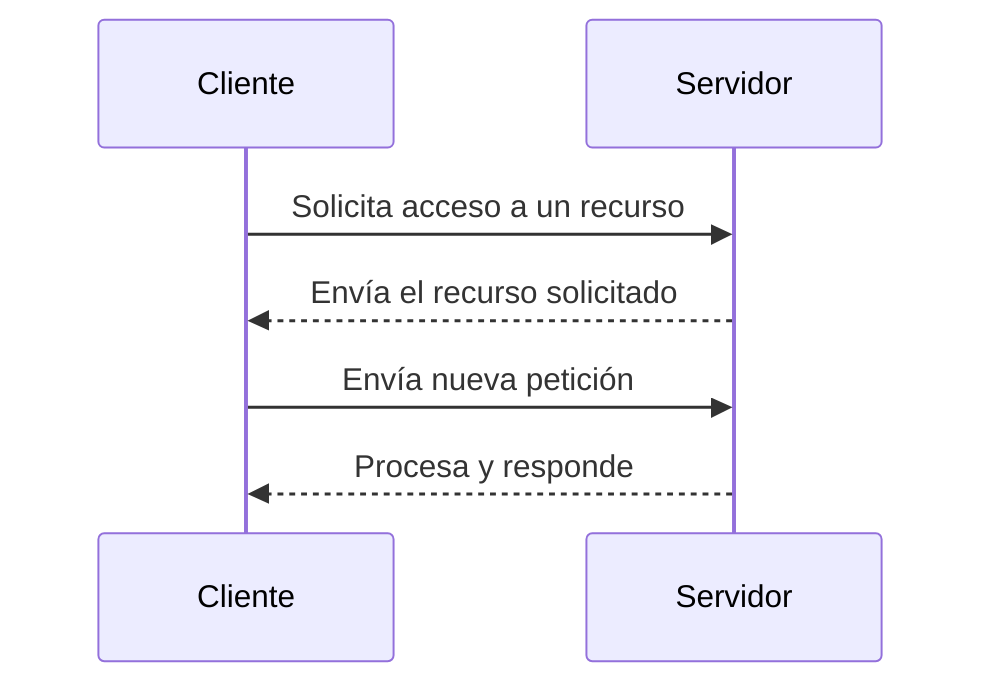
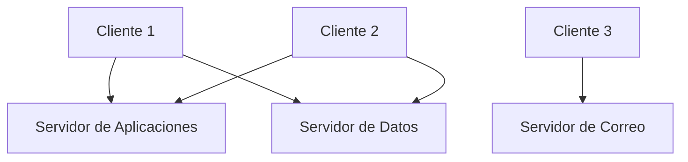

# Estructura Cliente-Servidor

El modelo **cliente-servidor** es una arquitectura distribuida en la que las tareas de una red se reparten entre dos tipos de equipos:

- **Servidor:** proporciona servicios o recursos (almacenamiento, correo, bases de datos, aplicaciones, etc.).  
- **Cliente:** solicita y utiliza esos servicios o recursos.

---

## Características principales

En este modelo, todos los datos y servicios se centralizan en uno o varios servidores, lo que permite una **gestión más organizada y eficiente** de la red.

!!! info "Ventajas del modelo cliente-servidor"
    - **Organización clara:** los recursos están localizados en puntos concretos.  
    - **Mayor seguridad:** las políticas de acceso se aplican de forma centralizada.  
    - **Escalabilidad:** se pueden añadir clientes sin alterar la estructura.  
    - **Mantenimiento más sencillo:** las actualizaciones se aplican desde el servidor.  

---

## Ejemplo de funcionamiento

Cuando un cliente necesita acceder a un archivo, aplicación o base de datos, envía una **petición** al servidor.  
El servidor procesa la solicitud y devuelve la **respuesta** con la información o el servicio solicitado.

Este modelo permite mantener una comunicación controlada, segura y estable entre los equipos.

---

## Problemas con múltiples servidores

Cuando en una organización existen varios servidores independientes, pueden surgir problemas de gestión y sincronización.

!!! warning "Ejemplo del Word"
- Un usuario necesita tres cuentas distintas para acceder a tres servidores.
- Si cambia su contraseña en uno, no se actualiza automáticamente en los demás.
- Al dar de baja a un empleado, el administrador debe eliminar su cuenta en cada servidor.
- Si se actualiza una base de datos en un servidor pero no en otro, pueden generarse errores o incoherencias.

Estas limitaciones evidencian la necesidad de una administración centralizada, que permita gestionar usuarios, permisos y recursos desde un solo punto.

Este problema será resuelto más adelante con los servicios de directorio.

---

## Diagrama conceptual

---

## En resumen

El modelo cliente-servidor permite una red más organizada, segura y escalable, pero cuando se multiplican los servidores, la gestión se complica. La solución a este problema llegará con los servicios de directorio, que centralizan toda la información de usuarios y recursos en una única base de datos.

---

  <button onclick="window.print()" style="
      background-color: var(--md-primary-fg-color);
      color: white;
      border: none;
      padding: 10px 20px;
      border-radius: 6px;
      font-size: 1em;
      cursor: pointer;
  ">
    📄 Descargar en PDF
  </button>

