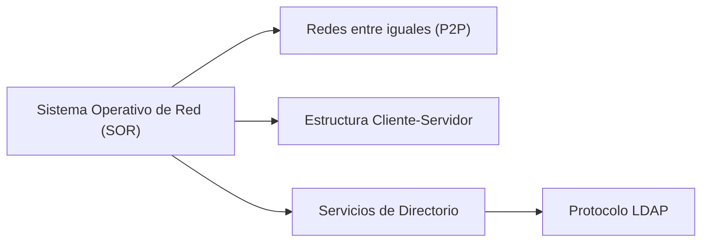

# Sistema Operativo de Red (SOR)

Un **Sistema Operativo de Red (SOR)** es el software encargado de gestionar la infraestructura completa de una red informática. Su función principal es permitir que los ordenadores compartan recursos de manera **segura, organizada y eficiente**.  
Sin un SOR, una red grande sería caótica: no existiría un control centralizado de archivos, usuarios o permisos, y la administración resultaría prácticamente imposible.

Los SOR se utilizan en todo tipo de entornos —desde pequeñas oficinas hasta grandes empresas o instituciones educativas— para **coordinar la comunicación entre equipos**, **centralizar la gestión** y **garantizar la seguridad** de la información.

---

## ¿Por qué necesitamos un Sistema Operativo de Red?

Del mismo modo que un ordenador individual requiere un sistema operativo (Windows, Linux o macOS) para funcionar, una red necesita su propio sistema operativo que gestione el intercambio de datos y recursos entre los distintos equipos.  
El SOR actúa como el **“cerebro” de la red**, permitiendo que los ordenadores conectados puedan comunicarse, compartir archivos, acceder a servicios comunes o conectarse a impresoras y servidores.

---

## Sistemas operativos estándar vs. sistemas operativos de red

Mientras los **sistemas operativos tradicionales** se centran en la gestión interna de un solo ordenador, los **sistemas operativos de red** amplían esta función al conjunto de equipos conectados.  
Esto implica una administración más compleja, pero también **una visión global del sistema**, donde se controlan usuarios, permisos, seguridad, dispositivos y servicios de manera centralizada.

| Tipo de sistema | Alcance | Función principal |
|------------------|----------|------------------|
| Sistema operativo estándar | Un único equipo | Gestionar recursos locales |
| Sistema operativo de red (SOR) | Conjunto de equipos conectados | Coordinar recursos compartidos y usuarios |

---

## Qué aprenderás en este tema

En esta unidad conocerás las **principales estructuras de red y sus formas de administración**, así como los servicios que hacen posible su correcto funcionamiento:

1. **Redes entre iguales (P2P)** → Cuando no existe un servidor central y todos los equipos comparten recursos directamente.  
2. **Modelo cliente-servidor** → Cuando la red se organiza mediante un servidor principal que gestiona peticiones de los clientes.  
3. **Servicios de directorio** → Sistemas que permiten centralizar la gestión de usuarios, equipos y permisos.  
4. **Protocolo LDAP** → Estándar que facilita la búsqueda y acceso a la información dentro de los servicios de directorio.

---

## Esquema general del tema

---

En definitiva, un sistema operativo de red constituye **la base organizativa y funcional** de cualquier infraestructura informática moderna.

A lo largo de esta unidad aprenderás cómo se estructuran las redes, qué papel cumple cada elemento y cómo se administra de forma segura y eficiente.

---

  <button onclick="window.print()" style="
      background-color: var(--md-primary-fg-color);
      color: white;
      border: none;
      padding: 10px 20px;
      border-radius: 6px;
      font-size: 1em;
      cursor: pointer;
  ">
    📄 Descargar en PDF
  </button>

