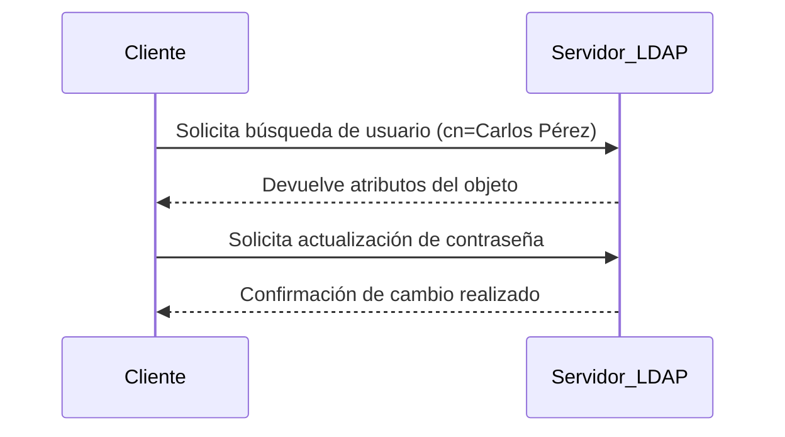
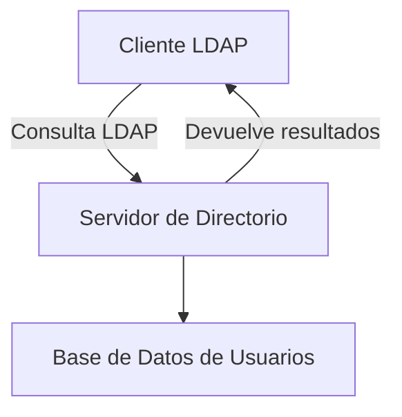

# Protocolo LDAP

El **LDAP (Lightweight Directory Access Protocol)** es un protocolo de nivel de aplicación diseñado para **acceder y gestionar servicios de directorio** en redes informáticas.  
Su función principal es **facilitar la búsqueda, consulta y modificación de información** dentro de una base de datos jerárquica, como las que utilizan los servicios de directorio.

LDAP se basa en el modelo cliente-servidor:  
- El **cliente** solicita información al servidor de directorio.  
- El **servidor LDAP** responde con los datos almacenados en su estructura jerárquica.

---

## Características principales

!!! info "Aspectos clave de LDAP"
    - **Ligero:** utiliza pocos recursos y es eficiente en entornos grandes.  
    - **Estándar abierto:** es compatible con múltiples sistemas operativos.  
    - **Jerárquico:** organiza la información en una estructura tipo árbol.  
    - **Flexible:** permite buscar, modificar, añadir o eliminar información en el directorio.  

---

## Cómo funciona LDAP

El protocolo LDAP permite **consultar y gestionar información** almacenada en un servicio de directorio mediante comandos estandarizados.  
Cada objeto dentro del directorio tiene un **DN (Distinguished Name)** único, que indica su posición exacta dentro del árbol jerárquico.

Ejemplo de DN:

Este DN se interpreta así:
- **cn:** nombre común del objeto (Carlos Pérez).  
- **ou:** unidad organizativa (TI).  
- **dc:** componentes del dominio (empresa.com).  

---

## Ejemplo de comunicación cliente-servidor



LDAP actúa como un puente entre el usuario y la base de datos del servicio de directorio, garantizando que las peticiones se procesen de manera rápida y segura.

---

## Ejemplo de entrada LDAP (formato LDIF)

```
dn: cn=Carlos Pérez,ou=TI,dc=empresa,dc=com
objectClass: inetOrgPerson
cn: Carlos Pérez
givenName: Carlos
sn: Pérez
title: Administrador de TI
mail: carlos@empresa.com
memberOf: cn=VPN,ou=Grupos,dc=empresa,dc=com
```

Este archivo define los atributos del usuario dentro del directorio, permitiendo su identificación y el control de sus permisos de acceso.

---

## Ventajas del uso de LDAP

!!! success "Beneficios de LDAP"
- Interoperabilidad: funciona con distintos sistemas (Windows, Linux, macOS).
- Seguridad: permite autenticación y cifrado de datos.
- Integración: se utiliza en servicios como Active Directory, OpenLDAP o SambaLDAP.
- Escalabilidad: adecuado para organizaciones grandes con miles de usuarios.

---

## Ejemplo gráfico



---

## En resumen

El **protocolo LDAP** es esencial para la administración de redes modernas. Permite acceder, autenticar y modificar información en los servicios de directorio de forma estandarizada y segura.

Gracias a LDAP, los administradores pueden gestionar de manera centralizada a los usuarios y recursos de toda la red.

---

<div style="margin-top: 2em; text-align: center;">
  <button onclick="window.print()" style="
      background-color: var(--md-primary-fg-color);
      color: white;
      border: none;
      padding: 10px 20px;
      border-radius: 6px;
      font-size: 1em;
      cursor: pointer;
  ">
    📄 Descargar en PDF
  </button>
</div>