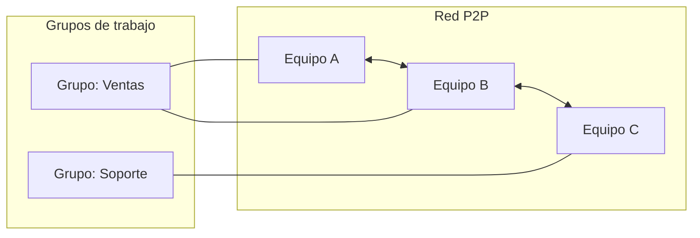

# Administración de una red entre iguales (P2P)

Las **redes entre iguales**, también llamadas **P2P (peer to peer)**, son aquellas en las que **no existe un servidor central** que controle la red.  
Cada equipo funciona a la vez como **cliente y servidor**, compartiendo directamente recursos (archivos, impresoras, carpetas, etc.) con los demás.

---

## Características principales

- Todos los equipos tienen el mismo nivel de autoridad y funciones.  
- Cada usuario decide **qué recursos compartir** y **cómo gestionarlos**.  
- No hay un punto único de control ni una jerarquía definida.  
- Son adecuadas para **redes pequeñas** o domésticas, donde la administración centralizada no es necesaria.  

---

## Problemas de administración y seguridad

!!! warning "Limitaciones de las redes P2P (según el Word)"
    - Cada usuario es responsable de su propia configuración.  
    - Los recursos compartidos pueden quedar expuestos a toda la red.  
    - Si muchos equipos comparten archivos sin un orden, encontrar uno específico puede ser complicado.  
    - A medida que la red crece, se vuelve **difícil mantener la organización y la seguridad**.

> Es como una biblioteca sin catálogo: hay muchos libros, pero nadie sabe exactamente dónde está cada uno.

---

## Los grupos de trabajo en Windows

Microsoft trató de solucionar parte de estos problemas mediante la creación de los **grupos de trabajo**.  
Un grupo de trabajo es una **agrupación lógica de equipos** que permite organizar los recursos compartidos por departamentos, ubicación o tipo de tarea.

!!! info "Ventajas de los grupos de trabajo"
    - Facilitan la organización de archivos y carpetas.  
    - Permiten compartir impresoras y dispositivos con más facilidad.  
    - Son simples de configurar en redes domésticas o de oficina pequeña.

Aun así, **no resuelven los problemas de seguridad ni de administración centralizada**.  
Cada ordenador sigue gestionando sus propios permisos, usuarios y contraseñas.

---

## Ejemplo gráfico

