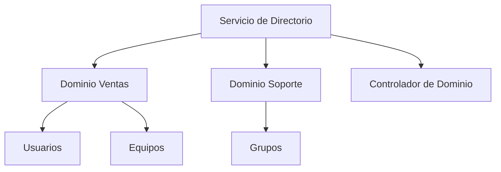

# Servicios de Directorio

Un **servicio de directorio** es un sistema que almacena, organiza y administra información sobre los elementos de una red.  
Su función principal es **centralizar la gestión de usuarios, equipos y recursos** para facilitar la administración y mejorar la seguridad.

A medida que una red crece, se vuelve complicado controlar manualmente los accesos, permisos o dispositivos.  
Los servicios de directorio permiten mantener toda esa información en una **base de datos estructurada y jerárquica**.

---

## Ejemplo práctico

Imaginemos una empresa o centro educativo con cientos de usuarios:

- El personal de administración puede acceder a los archivos contables.  
- El profesorado puede consultar materiales docentes y enviar comunicaciones.  
- El alumnado solo accede a los recursos de su grupo o clase.  

El servicio de directorio se encarga de **definir quién puede acceder a qué**, de forma automática y segura, evitando errores humanos y mejorando la eficiencia.

---

## Estructura de un servicio de directorio

Un servicio de directorio organiza la información en forma de **objetos**, y cada objeto posee **atributos** que describen sus características.

### Ejemplo de objeto

| Atributo | Valor |
|-----------|--------|
| **Nombre** | Carlos Pérez |
| **Cargo** | Administrador de TI |
| **Correo** | carlos@empresa.com |
| **Accesos** | Servidor de archivos, correo, VPN |

Estos objetos se agrupan en una estructura jerárquica similar a la de un **árbol**, con niveles que representan dominios, unidades organizativas y usuarios.

---

## Componentes principales

| Elemento | Descripción |
|-----------|-------------|
| **Directorio** | Base de datos que almacena la información de todos los recursos de la red. |
| **Dominio** | Conjunto de objetos gestionados bajo una misma política de seguridad. |
| **Objeto** | Cada usuario, equipo, impresora o carpeta compartida de la red. |
| **Unidad Organizativa (OU)** | Agrupa objetos de un mismo departamento o área funcional. |
| **Grupo** | Colección de usuarios con permisos similares. |
| **Controlador de dominio** | Servidor que administra y autentica el acceso a la base de datos del directorio. |
| **Catálogo global** | Contiene información parcial o completa de todos los objetos del dominio. |

---

## Ventajas de los servicios de directorio

!!! info "Beneficios clave"
    - **Centralización:** un único punto de administración para toda la red.  
    - **Seguridad:** control de acceso basado en políticas y permisos.  
    - **Escalabilidad:** adaptable a redes pequeñas o grandes organizaciones.  
    - **Eficiencia:** reducción de errores humanos y tareas repetitivas.  

---

## Ejemplo gráfico

---

## En resumen

Los **servicios de directorio** simplifican la administración de redes al centralizar la información y el control de los recursos.

Gracias a ellos, se pueden aplicar políticas de seguridad, gestionar accesos y mantener la coherencia de los datos en toda la organización.

El siguiente paso será estudiar cómo el **protocolo LDAP** hace posible la comunicación entre clientes y servidores dentro de estos servicios.

---

  <button onclick="window.print()" style="
      background-color: var(--md-primary-fg-color);
      color: white;
      border: none;
      padding: 10px 20px;
      border-radius: 6px;
      font-size: 1em;
      cursor: pointer;
  ">
    📄 Descargar en PDF
  </button>

